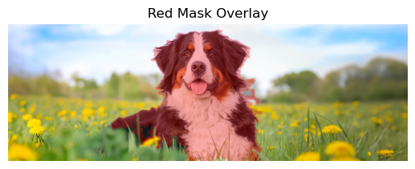
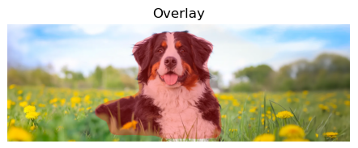

# Dog Image Segmentation in a Field

This project demonstrates two approaches to segment a dog in images:

1. **Traditional Image Processing** using OpenCV to segment the dog from a field background (based on color thresholding, morphology, and contour detection).  
2. **Deep Learning-based Segmentation** using a pretrained **Mask R-CNN** model from PyTorch's torchvision library for accurate dog detection and mask prediction.

---

## Table of Contents

- [Introduction](#introduction)  
- [Setup](#setup)   
- [Output Examples](#output-examples)  

---

## Introduction

This project aims to detect and segment dogs from images containing one dog in a field environment. 

- The **OpenCV approach** uses HSV color thresholding to separate grass from non-grass, adaptive thresholding to isolate the dog, and morphological operations to clean the mask.  
- The **PyTorch approach** uses a Mask R-CNN model pretrained on the COCO dataset, which includes a "dog" class, to predict precise segmentation masks.

Images used for testing can be any one dog in field images, such as those found from random image sources like Google.

---

## Setup

### Prerequisites

To run this project, ensure you have the following Python libraries installed:

- `numpy`
- `matplotlib`
- `opencv-python`
- `pillow`
- `torch`
- `torchvision`

You can install them by running the following command in your terminal:
```bash
pip install numpy 
pip install matplotlib 
pip install opencv-python 
pip install pillow 
pip install torch 
pip install torchvision
```
---

## Output Examples
Below are example outputs from the two dog segmentation approaches:

### OpenCV  HSV color thresholding

This example shows the dog detected using the OpenCV color-based segmentation method, with a red overlay mask highlighting the detected dog.



---

### PyTorch Mask R-CNN Segmentation

This example shows the dog detected using the deep learning Mask R-CNN model, with a red overlay mask.



